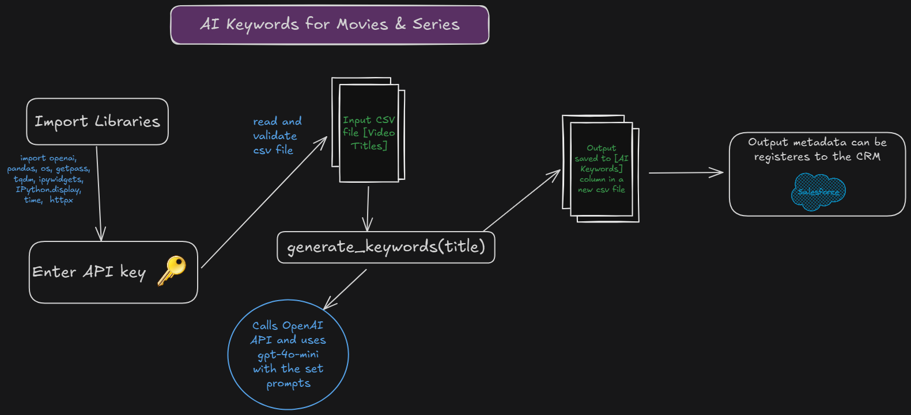

# AI-Powered Metadata Keyword Generator for Movies & Series
This project uses OpenAI GPT to generate search-optimized metadata keywords (in English and Arabic) for movie and series titles.

---

## Features
- Uses OpenAI GPT to generate **30 smart keywords** per title  
  (15 English + 15 Arabic, with the title included in each)
- Works with a CSV file containing a list of video titles
- Retry mechanism with fallback prompt
- Saves the results into a new CSV file
- Integrates easily into existing content pipelines

---

## Requirements
This project uses Python on Google Colab

---
##Project Design Overview

