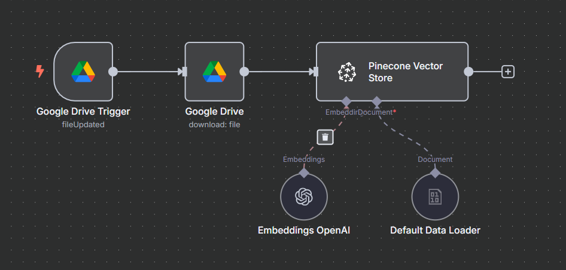
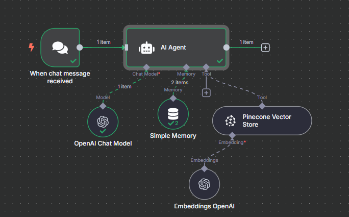

# Project Overview

## 1. Web Scraper (FAQ Extractor)

A Python-based web scraper that extracts all frequently asked questions and answers from [starzplay.com/en/faq](https://starzplay.com/en/faq), organised by category tabs.

### Features
- Extracts all FAQ questions and answers from each tab
- Bypasses bot protection using `undetected-chromedriver`
- Mimics real user behaviour with `selenium-stealth`
- Saves output to:
  - `starzplay_faq.csv` (structured table format)
  - `starzplay_faq.txt` (plain text Q&A)

---

### Technologies Used
- Python (run locally)
- Selenium (via `undetected-chromedriver`)
- Selenium Stealth
- BeautifulSoup4
- Pandas

---

## 2. RAG Chatbot (Retrieval-Augmented Generation)

### Features
- Loads the `starzplay_faq.csv` from **Google Drive**
- Uses **SentenceTransformer** to create local embeddings
- Stores embeddings in **Pinecone Vector Database**
- On query, retrieves relevant answers and uses **OpenAI GPT-4.1-nano** to generate a helpful, focused response

### Tech Stack
- LangChain
- SentenceTransformers
- Pinecone
- OpenAI Chat API
- Google Colab + Google Drive

---

## n8n Workflows

I also built automated workflows using [**n8n**](https://n8n.io/) to support and scale this system:

### Workflow 1: FAQ Knowledge Base Uploader
Automatically detects when a new FAQ file is uploaded to **Google Drive** and embeds it into **Pinecone Vector Store**.

[View the Workflow](#) *(https://khadija-17.app.n8n.cloud/workflow/45UZ0h9PVEd8pDDu)*

---

### Workflow 2: Chatbot Q&A Engine
Handles incoming user queries via chat, performs semantic search using OpenAI embeddings, retrieves matching answers from Pinecone, and responds via OpenAI chat model.

[View the Workflow](#) *(https://khadija-17.app.n8n.cloud/workflow/zJNuokUjgYB97k3b)*

---

## Files

- `faq_scraper.py` – Python scraper script for collecting FAQ data from starzplay.com/en/faq
- `RAG_Chatbot.ipynb` – Colab-compatible chatbot with embedded FAQ knowledge
- `starzplay_faq.csv` – Output file from the scraper containing structured Q&A
- `starzplay_faq.txt` – Text-based version for readability

---
